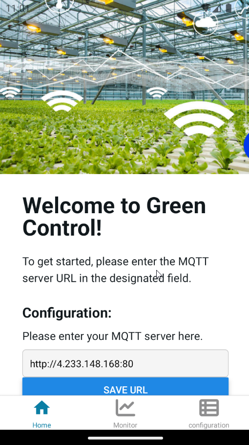
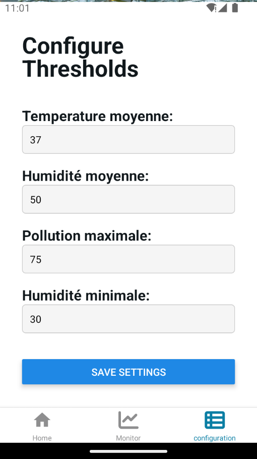
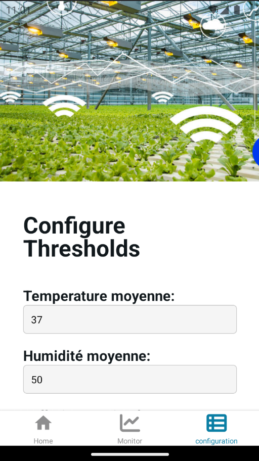
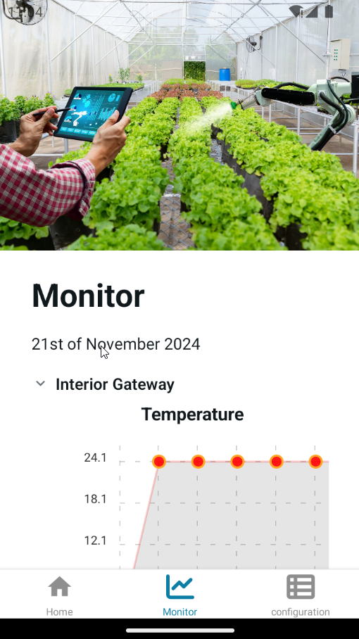
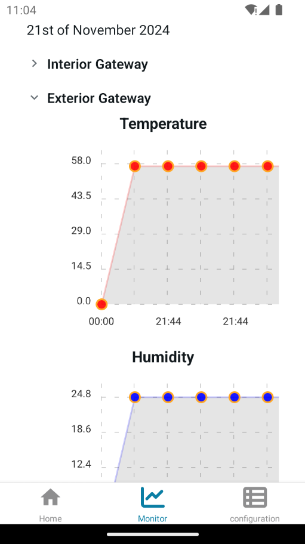

# 🌱 Green Control Mobile App 🌱

**Green Control** is a mobile application designed to monitor and manage conditions inside greenhouses, ensuring crop quality while minimizing energy usage. The app allows you to:  

- Monitor internal and external environmental conditions (temperature, humidity, air quality, and soil moisture).  
- Adjust thresholds for optimal greenhouse management.  
- Receive alerts for extreme environmental conditions.  
- Control greenhouse actions like ventilation, heating, cooling, and irrigation remotely.  

---

<div style="display:flex;flex-direction:column;justify-content:canter;" align="center">
    <div>
        
        
        
    </div>
    <br/>
    <div>
        
        
    </div>
</div>


## 🚀 Getting Started  

### Prerequisites  
Ensure you have the following installed:  
- [Node.js](https://nodejs.org/)  
- [Expo CLI](https://expo.dev/)  

---

### Install Dependencies  

Run the following command in the terminal:  

```bash
npm install
```

---

### Start the App  

Start the development environment with:  

```bash
npx expo start
```

In the output, you'll find options to open the app in:  
1. A **development build**  
2. **Android emulator**  
3. **iOS simulator**  
4. **Expo Go**, a limited sandbox for trying out app development with Expo  

---

## 📂 File Structure  

The main files and folders you'll interact with are:  

- **`app/`**: Contains all the app screens and components.  
- **`assets/`**: Stores images, fonts, and other static files.  
- **`package.json`**: Manages dependencies and scripts for the project.  

---

## 🛠️ Features  

- **Threshold Adjustments**: Modify the temperature, humidity, and pollution limits.  
- **Real-Time Monitoring**: View both internal and external conditions live.  
- **Alerts**: Get notified when conditions exceed thresholds.  
- **Energy Efficiency**: Optimize actions to reduce energy usage (e.g., use external ventilation if outdoor conditions are suitable).  

---

## 📱 Mobile App Use Case  

The app connects to the hardware system inside the greenhouse:  

- **Internal PCB**: Detects environmental data (temperature, humidity, air quality, and soil moisture).  
- **External PCB**: Collects data from outside the greenhouse.  

The system compares internal and external conditions and takes appropriate actions, such as:  
- Activating ventilation.  
- Adjusting climate control.  
- Managing irrigation.  

---

