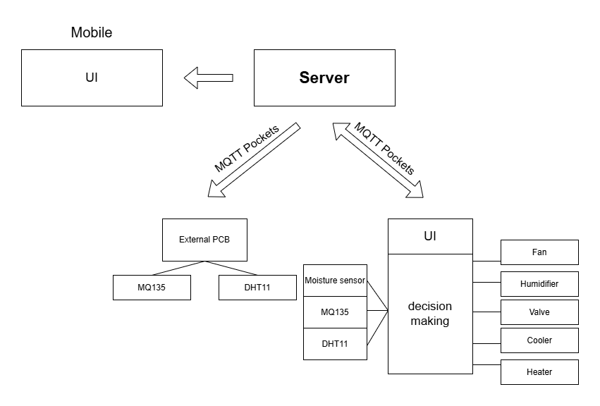

# Green Control System 🌿

Welcome to the **Green Control System** repository! This project is designed to monitor and regulate greenhouse conditions, ensuring optimal environments for crops while minimizing energy consumption.

## Project Structure

This repository is divided into the following folders:

1. **Mobile App**: 
   A cross-platform app built with Expo, allowing users to monitor and adjust greenhouse thresholds, view real-time data, and receive alerts for extreme conditions.
   - 📂 **[Mobile App Folder](./Mobile_App)**
   - 📄 **[Mobile App README](./Mobile_App/README.md)**

2. **Server**: 
   A Dockerized server that connects the mobile app to two PCBs (internal and external), facilitating data exchange and decision-making for greenhouse control.
   - 📂 **[Server Folder](./GreenControl_Server)**
   - 📄 **[Server README](./Server/README.md)**

3. **ESP32 (Arduino Code) for Internal PCB**: 
   Code for the ESP32 microcontroller managing sensors and actuators in the greenhouse.
   - 📂 **[ESP32 Folder](./Internal_PCB)**
   - 📄 **[ESP32 README](./Internal_PCB/README.md)**

3. **ESP32 (Arduino Code) for External PCB**: 
   Code for the ESP32 microcontroller managing sensors and actuators in the greenhouse.
   - 📂 **[ESP32 Folder](./External_PCB)**
   - 📄 **[ESP32 README](./External_PCB/README.md)**


<div style="display:flex;flex-direction:column;justify-content:canter;" align="center">
    <div>
        
    </div>
    <br/>
    <div>
        
        
    </div>
    <br/>
    <div>
        
    </div>
</div>

## How It Works

1. **Internal PCB**:
   - Collects data on temperature, humidity, air quality, and soil moisture within the greenhouse.
   - Actuates devices like fans, valves, heaters, and humidifiers based on thresholds.

2. **External PCB**:
   - Monitors external environmental conditions (temperature, humidity, and air quality).
   - Shares data with the internal PCB to optimize ventilation and energy usage.

3. **Mobile App**:
   - Allows users to set thresholds, view real-time conditions, and receive alerts.

4. **Server**:
   - Facilitates communication between the mobile app and PCBs.
   - Manages MQTT messaging and data storage.

## Getting Started

### Clone the Repository
```bash
git clone https://github.com/yourusername/green-control-system.git
cd green-control-system
```

### Explore Each Component
Follow the instructions in the respective folders' README files to set up and run the components.

## Contributing
Feel free to submit issues or pull requests. Contributions are welcome to improve and expand the system.

## License
This project is licensed under the MIT License.

---

🎉 **Enjoy a smarter, more efficient way to manage greenhouses!**
